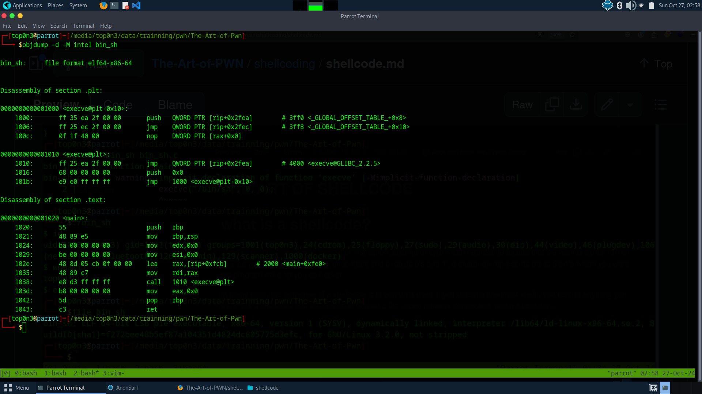
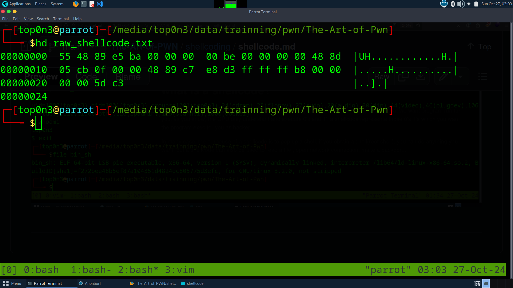

# THE ART OF SHELLCODE

# what is a shellcode?
 to make simple, a shellcode is a set of instructions, a string of byte which represente a code that we want program
run for you. as you know, the CPU only understant and execute 0's and 1', a shellcode represente those 0's 1's which you want the program exec for you as hacker.

In many case, the purpouse of a shellcode is to pop up a shell. if you obtain a shell(root shell), you can do anything you want. but a shellcode can also be used to read a file , open network connection, make a backdor...
example: this string is a shellcode: "ijhh\x2f\x2f\x2fsh\x2fbin\x89\xe3h\x01\x01\x01\x01\x814\x24ri\x01\x011\xc9Qj\x04Y\x01\xe1Q\x89\xe11\xd2j\x0bX\xcd\x80"


# When could i use a shellcode.
Hacker use shellcode to  exploit weakness in software and make that software execute instructions they control
if you can trigger a program to execute your shellcode, you can make this software execute any command for you.
imagine an instance where you get acces to a remote machine,you dont have permision to read sensitive file as you don't have permision. if you found a vulnerable program(program which is vuln to shelcode injection) which run root permission, you can exploit this to get root access. 


# how to write a shellcdoe:::
there is many way to write a shellcode. It is an art and you master it as long as you make pratice.
the purpose of this cours is to help reader become shellcoders.
it take time to become skilled in this field. it need many pratice. undertand assambled language is mandatory 

i will show you free way to write shellcode.

1 - #   write your program i C langage, compile it and  get the shellcode

2-  #    write your  shellcode in assembled langage, compile it

3 - #    use automate tool to write your shellcode. 

# let explain each of these method

# FROM C program to shellcode.
 I dont recommanded this methodology . because it make you very limited and in some case, you can not use it
how to do that.
    i suppose you know C programming Langage.
    - write your code in C program. 
    - compile your code
    - from the binary code, extract your shellcode

Example:
  /bin/sh shellcode
```
in main(){
execve("/bin/sh", NULL, NULL)
return 0;
}
```
compile the program: 
`` gcc -nostartfiles -o bin_sh bin_sh.c``

you can decompile the program with objdump to  get the assembled code of main function

``objdump -d -M intel bin_sh``





# 
# time to  get the shellcode of this elf file:
to do that, i will use objcopy. a tool  to inspect, modify ELF file

cmd: ``objcopy --dump-section .text=raw_shellcode.txt bin_sh``

this will produce raw_shellcode.txt file containing your shellcode in raw format



in the next article, i will show you how to test your shellcode

